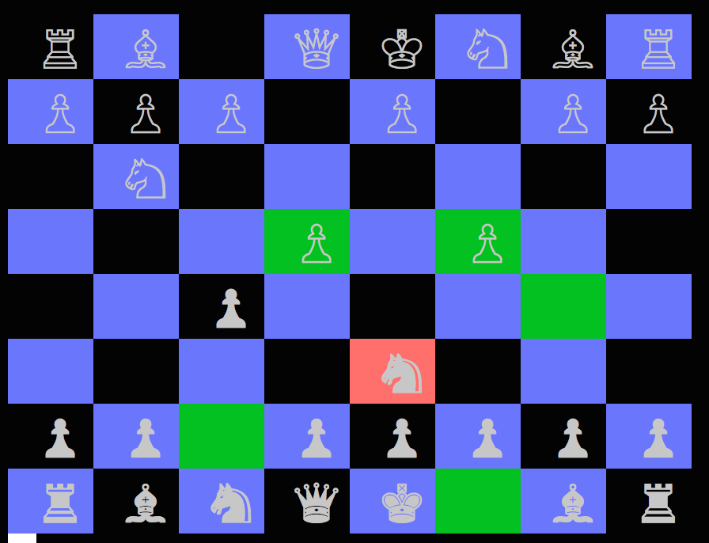

# Chess

## Description
Ruby console based Chess

This is console based iteration of Chess built entirely in Ruby. 

## Features
* Uses deep-duplication method to pass board state to each piece, allowing each piece to independently validate its moves, preventing the user from making illegal moves
* DRY code utilizing Slidable and Steppable classes to minimize overlap and redundancies 

## Things to Come
* [ ] Improved Gameflow, players, game start screen, game end screen 
* [ ] Save games
* [ ] AI
